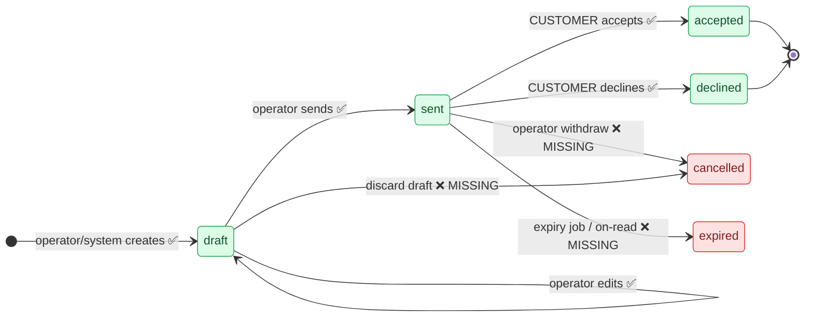
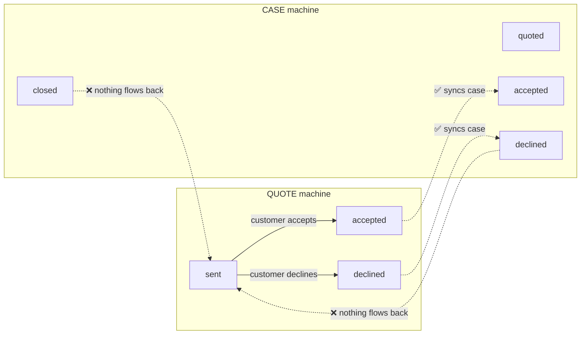

# .agents

Shared agent configuration for Pi / Claude / Codex.

## Source of truth

- `AGENTS.md` — neutral global core instructions and the symlink target for tools.
- `skills/` — canonical skill repo. Everything reusable lives here: workflows, specialist personas, review/test/planning helpers.

## Rules

- Keep the global core neutral. No ambient Lucy/personality/specialist mode.
- Personas are skills with `disable-model-invocation: true` when supported.
- Workflow skills may be auto-invoked by the agent when their descriptions match.
- Prompt/slash aliases are optional UX sugar only; never duplicate persona/workflow logic there.

## Current wiring

- `~/.pi/APPEND_SYSTEM.md -> ~/.agents/AGENTS.md`
- `~/.claude/CLAUDE.md -> ~/.agents/AGENTS.md`
- `~/.codex/AGENTS.md -> ~/.agents/AGENTS.md`
- `~/.claude/skills -> ~/.agents/skills`

Codex reads user skills directly from `~/.agents/skills`; do not replace
`~/.codex/skills`, which Codex owns for system and installed skills.

Knowledge, experience, and vault content live in `~/knowledge/`.

## Notes and usefull links

https://impeccable.style/docs/

