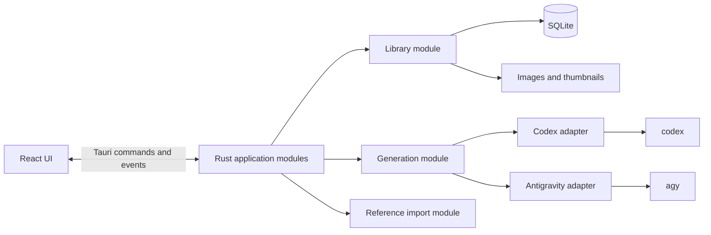

# Image Gen desktop application design

## Status

Design approved. The Variant A Studio rail interface is implemented.

## Product intent

Image Gen is a fast, private desktop application for generating and browsing images through the user's existing consumer subscriptions.

It is an internal tool, not a public SaaS product. It must not ask for API keys, read provider credential caches, use private web endpoints, or introduce Google Cloud or Vertex AI credentials.

The first release targets macOS. The architecture should keep Linux possible without weakening macOS startup speed or usability.

## Decisions

| Area | Decision |
| --- | --- |
| Desktop framework | Tauri 2 |
| UI | React, TypeScript, and Vite |
| Native backend | Rust |
| Metadata | SQLite through Rust; never accessed directly by the UI |
| Images | Normal files; never database blobs |
| Providers | OpenAI Codex and Google Antigravity |
| Authentication | Existing provider CLI login only |
| Initial maximum variants | 3 per selected provider |
| Default output root | `~/Pictures/Image Gen` |
| App metadata | `~/Library/Application Support/Image Gen` on macOS |
| Distribution | Developer ID signed and notarized app, outside the Mac App Store |
| Linux | Supported later through the same Tauri application and provider adapters |

Do not use Electron, Next.js, an embedded web server, or SwiftUI. Electron is too heavy for this tool. SwiftUI would make a later Linux version a rewrite.

## Primary use cases

### Open the application from Pi

A Pi command only needs to map to a shell command. The packaged macOS command is:

```bash
open -a "Image Gen"
```

The application must be single-instance. Running the command again focuses the existing window instead of opening a second process.

During development, provide one script such as `./dev.sh` that starts the Tauri development application. Do not make the Pi command depend on a development build once an installed app exists.

### Generate images

The user can:

1. Write a prompt.
2. Add zero or more reference images.
3. Add references from previous generations or paste an image from the clipboard.
4. Select OpenAI, Antigravity, or both.
5. Request one, two, or three variants from each selected provider.
6. Submit the batch and watch each job progress independently.

Selecting two providers and three variants creates six jobs. The submit button should say **Generate 6 images** so quota use is clear before submission.

### Browse images

The main window offers two library views:

1. **Images**: a newest-first contact sheet of successful outputs.
2. **Batches**: chronological generation history with incremental loading.
3. Batch, provider, status, and creation-time details.
4. Failed, cancelled, and interrupted jobs alongside successful jobs.

Selecting an image opens a modal preview. Focus enters the preview, remains inside it while open, and returns to the invoking control after Close, Escape, or backdrop dismissal. The preview provides these actions:

- Copy image
- Reveal in Finder
- Use as reference
- Retry generation
- Delete from library — later, and only with a confirmation dialog

Deletion is not part of the first implementation.

## Experience design

### Visual direction

Use a quiet contact-sheet language:

- System font in compact, workhorse sizes
- System light and dark modes
- Cool proof-paper surfaces with near-black ink
- Registration blue as the restrained accent
- Square image fields, hairline dividers, and almost no containers
- Small corner radii and neutral shadows only where elevation matters
- No gradients, glass effects, marketing panels, or decorative animation
- Motion only where it explains job progress or navigation

The application should feel like a small macOS utility, not a website inside a window.

### Main window

Recommended minimum size: 1,000 × 680 px.

```text
┌───────────────────────────────────────────────────────────────┐
│ Image Gen                                  History   Settings  │
├──────────────────────────────────────────┬────────────────────┤
│ Library                 [Images|Batches] │ Make images        │
│ ┌────────┐ ┌────────┐ ┌────────┐ ┌─────┐│ References         │
│ │ image  │ │ image  │ │ image  │ │ ... ││ Prompt             │
│ └────────┘ └────────┘ └────────┘ └─────┘│ Providers           │
│ ┌────────┐ ┌────────┐ ┌────────┐ ┌─────┐│ Images each         │
│ │ image  │ │ image  │ │ image  │ │ ... ││ 2 providers · 6 jobs│
│ └────────┘ └────────┘ └────────┘ └─────┘│ [Generate 6 images] │
└──────────────────────────────────────────┴────────────────────┘
```

The library leads in the flexible left field. The complete generation setup remains visible in a 356 px right rail. Settings replace the library field without hiding the rail. At 780 px and below, stack the generation setup before the library so visual, keyboard, and assistive-technology order agree. Use two contact-sheet columns on narrow screens and avoid horizontal overflow.

Do not load full-resolution files for the grid. Load generated thumbnails and open the original only in the preview.

### Generation composer

The persistent **Make images** rail contains references, prompt, providers, images per provider, the calculated job summary, and the Generate action. It is not a modal, drawer, or second operating-system window. Selecting two providers and three images each must show six jobs before submission and label the action **Generate 6 images**.

Generated work appears in **Batches**, where each provider and variant keeps its independent queued, running, succeeded, failed, cancelled, or interrupted state and recovery actions.

Keyboard shortcuts:

- `Command+N`: show the library and focus the prompt
- `Command+V`: paste an image reference while the app is active
- `Command+Enter`: submit the current generation setup
- `Command+,`: show settings
- `Escape`: close the image preview

### Settings

Keep settings narrow in the first release:

- Output directory
- Absolute `codex` executable path
- Absolute `agy` executable path

Detect likely executable locations after first paint, then let the user correct them. Never show or store provider credentials. Do not add appearance, concurrency, model, or prompt-template settings yet.

## Domain model

Use these terms in code, UI copy, tests, and documentation.

### Generation batch

One user submission. It owns the prompt, selected providers, variant count, and references.

### Generation job

One provider producing one image for a batch. A batch with two providers and three variants owns six jobs.

Job rows are immutable attempts. Their allowed transitions are:

| From | To |
| --- | --- |
| `queued` | `running`, `cancelled`, `interrupted` |
| `running` | `succeeded`, `failed`, `cancelled`, `interrupted` |
| Any terminal state | None |

On normal cancellation, queued jobs become `cancelled`. Running jobs receive `SIGTERM` as a process group, get a three-second grace period, and then receive `SIGKILL` if still alive. On startup after an abnormal exit, every surviving `queued` or `running` job becomes `interrupted`.

Retry creates a new queued job linked to the old attempt. It never overwrites the failed, cancelled, or interrupted row. Never resume quota-consuming work automatically.

### Asset

An image known to the library. An asset can be generated output or an imported reference. Store its path, media type, size, dimensions, checksum, and thumbnail path.

### Provider

A supported subscription-backed generator. The first provider adapters are `openai` and `antigravity`.

### Reference

An asset attached to a generation batch as input context. References come from history or clipboard paste in the first release.

## Architecture



### Generation module

This must be a deep module. The UI should know only a small interface:

```text
create_batch(input) -> batch
cancel_job(job_id)
retry_job(job_id) -> new_job
```

The module hides:

- Provider-specific prompts and flags
- Credential-variable removal
- Executable discovery
- Subprocess management and cancellation
- Concurrency limits
- Progress parsing
- Output validation
- Error classification
- Database updates

The UI receives normalized `job_updated` events. It must not parse raw Codex or Antigravity output.

There are two real provider adapters, so the provider seam is justified. Both adapters accept the same internal request and return the same result shape.

### Provider execution

Implement packaged provider execution in Rust. Launch each provider with an absolute executable path and an argument array, never through `sh -c`, a login shell, or a concatenated command string.

A Finder-launched macOS app does not reliably inherit the user's shell `PATH`. Resolve executable paths from explicit settings first, then known local locations such as `~/.local/bin`, `/opt/homebrew/bin`, and `/usr/local/bin`. If a binary is still missing, ask the user to select it. Do not run provider login checks during startup.

The existing [`generate.sh`](./generate.sh) remains the terminal proof and a reference for prompt and environment policy. The packaged app must not depend on that script, `python3`, `grep`, or `file`, and does not bundle the provider CLIs.

Every real adapter invocation must pass through the scheduler. Launch running jobs in their own process group so Cancel can terminate the complete provider process tree.

Provider rules:

- Never store or inspect OAuth tokens.
- Never set API keys or Google Cloud variables.
- Remove those variables from every child process.
- Use the installed `codex` and `agy` clients and their cached account login.
- Do not fall back to SVG, HTML, Canvas, MCP tools, public APIs, or private endpoints.
- Validate that output is a non-empty supported raster image before marking a job successful.

### Job scheduling

Initial limits:

- At most one running job per provider.
- At most two running jobs globally.
- Different providers may run concurrently.
- Multiple variants for one provider run in order.

These limits avoid accidental quota bursts while still allowing OpenAI and Antigravity to work in parallel. Keep them internal rather than exposing settings in the first release.

### Error classification

Normalize provider failures into:

- `provider_unavailable`
- `authentication_required`
- `quota_exhausted`
- `backend_error`
- `permission_denied`
- `timeout`
- `invalid_output`
- `cancelled`
- `interrupted`
- `unknown`

Keep a redacted diagnostic message for troubleshooting. Never persist authorization URLs, cookies, access tokens, or credential-cache contents.

The current Antigravity HTTP 500 should appear as a failed `backend_error` job with a Retry action.

## References and clipboard

### Previous generations

The preview and gallery cards expose **Use as reference**. This focuses the persistent composer and attaches the selected asset without copying the original file.

### Clipboard

While the app is active, handle paste events containing image bytes:

1. Read only the image item from the paste event.
2. Send the bytes to Rust.
3. Validate the media type and decode the image.
4. Normalize it to PNG when needed.
5. Store it as a reference asset.
6. Generate a thumbnail.
7. Show it in the composer.

Do not read the clipboard continuously or during application startup.

First-release limits:

- PNG, JPEG, and WebP only
- At most 8 references per batch
- At most 20 MB encoded per reference
- At most 40 megapixels and 12,000 px on either side after decoding
- At most 80 MB encoded across one batch

Reject unsupported, oversized, or invalid images before persistence and show a short visible error. Drag-and-drop import can follow after the first release.

### Provider handoff

Create a private workspace for each job. Make its references available there and identify each reference path clearly in the provider prompt. The provider adapter owns this detail.

If a provider cannot accept references for a request, fail clearly. Do not silently ignore them.

## Persistence

### File layout

```text
~/Pictures/Image Gen/
└── YYYY/MM/
    └── <job-id>.png

~/Library/Application Support/Image Gen/
├── library.sqlite
├── references/
│   └── <sha256>.<extension>
├── thumbnails/
│   └── <asset-id>.webp
└── logs/
    └── image-gen.log
```

Use the platform's standard pictures and application-data directories rather than hard-coding these strings. Linux should use the equivalent XDG directories.

### Database shape

```text
generation_batches
  id, prompt, variant_count, created_at

generation_jobs
  id, batch_id, provider, variant_index, status,
  retry_of_job_id, output_asset_id, error_code, error_message,
  created_at, started_at, finished_at

assets
  id, kind, path, thumbnail_path, media_type,
  width, height, byte_size, sha256, created_at

batch_references
  batch_id, asset_id, position
```

Use bundled, versioned migrations. The Rust library module owns all database access.

Load history in descending `(created_at, id)` order with an exclusive `(created_at, id)` cursor. New batches prepend through application events and do not change an older page's cursor. Paging to the oldest batch must produce no duplicates or omissions and must include failed, cancelled, and interrupted jobs. Do not read the whole database or scan the image directory during startup.

## Startup performance

Startup speed is a product requirement.

Targets on the development Mac:

- Warm launch to visible window: under 500 ms
- Cold launch to visible window: under 1.5 seconds
- Window interactive: under 2 seconds

Rules:

1. Render the application shell before loading history.
2. Open SQLite and load only the latest page after first paint.
3. Show thumbnail placeholders while files load.
4. Never contact a provider or test authentication during startup.
5. Discover likely executable paths locally after first paint; defer authentication checks until generation or an explicit user action.
6. Do not scan output folders during startup.
7. Do not load full-resolution images for gallery cards.
8. Keep the frontend bundle small; avoid a large UI framework and global state library.
9. Record startup timing in development and add a release smoke check.

Measure a signed release build on the development Mac. Record the hardware and OS with the result. Start timing immediately before process launch and stop when the frontend reports its first interactive paint through a monotonic application marker. Measure ten launches per case and require the p90 to meet the budgets. A warm case follows a prior launch; a cold case follows application termination and a machine restart for the release check.

Use `tauri-plugin-single-instance`. A second launch must unminimize, activate, and focus the existing main window without creating another process-owned window.

## Suggested dependencies

Keep the list small and verify current versions before installation.

### Frontend

- React
- TypeScript
- Vite
- `@tauri-apps/api`
- Lucide icons
- Plain CSS with design tokens; no Tailwind requirement

Use React state and context initially. Add a state library only if real complexity appears.

### Rust

- Tauri 2
- `tokio` for child processes and job scheduling
- `serde` for command and event types
- `rusqlite` for metadata
- `uuid` for identifiers
- `sha2` for asset checksums
- `image` for validation and thumbnails
- `thiserror` for typed errors
- `tracing` for redacted local diagnostics

## Planned source layout

```text
image-gen/
├── DESIGN.md
├── README.md
├── generate.sh
├── package.json
├── src/
│   ├── app/
│   ├── generation/
│   ├── history/
│   ├── preview/
│   ├── settings/
│   └── styles/
└── src-tauri/
    ├── Cargo.toml
    ├── tauri.conf.json
    └── src/
        ├── main.rs
        ├── generation/
        │   ├── mod.rs
        │   ├── scheduler.rs
        │   ├── openai.rs
        │   └── antigravity.rs
        ├── library/
        │   ├── mod.rs
        │   ├── database.rs
        │   └── thumbnails.rs
        ├── references/
        │   └── mod.rs
        └── startup.rs
```

Prefer modules with small interfaces and deep implementations. Do not split every type into its own file or add pass-through layers.

## Testing strategy

### Rust

- Generation state-machine tests
- Scheduling and concurrency tests
- Provider command construction tests
- Credential-variable removal tests
- Output image validation tests
- Error classification tests, including Antigravity HTTP 500
- SQLite migration and history-query tests
- Reference import and thumbnail tests

Use fake provider executables in tests. Unit and integration tests must not consume subscription quota.

### Frontend

- Batch total calculation
- Provider and variant selection
- Clipboard-reference flow with mocked bytes
- Job progress and failure rendering
- History pagination
- Preview actions

Mock the Tauri command interface. Keep end-to-end tests focused on a few main flows.

### Manual proof

Before calling the release usable:

1. Open it through `open -a "Image Gen"`.
2. Confirm a second launch focuses the same window.
3. Generate one OpenAI image.
4. Generate one Antigravity image when Google's backend is healthy.
5. Generate a two-provider batch.
6. Paste a clipboard reference and generate from it.
7. Use a previous generation as a reference.
8. Cancel a running job.
9. Restart the app and confirm history remains intact.
10. Confirm no API or Google Cloud credential variables are needed.

## Implementation order

1. Scaffold Tauri, React, and the visible application shell.
2. Measure startup before adding features.
3. Add the domain types, SQLite migrations, stable history paging, and library queries.
4. Add the generation module, complete lifecycle, scheduler, cancellation, retry, and interrupted-job recovery using fake adapters.
5. Build the composer, batch cards, gallery, and preview against fakes.
6. Add clipboard and previous-image references with validation limits.
7. Connect the Rust OpenAI adapter through the scheduler.
8. Connect the Rust Antigravity adapter through the scheduler and preserve backend errors.
9. Prove single-provider and concurrent two-provider batches.
10. Add the macOS launcher, icon, signing configuration, and startup smoke test.

Use one writer at a time in this checkout. If several agents write concurrently, give each one an isolated worktree and non-overlapping ownership.

## First-release acceptance criteria

- The packaged app opens from `open -a "Image Gen"`.
- A second `open -a "Image Gen"` unminimizes, activates, and focuses the existing window without creating another window.
- Warm and cold startup meet the stated measurement budgets.
- Latest generations and cursor-paged history render from SQLite through the oldest batch without duplicates or omissions, including failed and interrupted jobs.
- The user can select one or both providers.
- The user can request one to three variants per provider.
- The user can paste or reuse reference images within the stated validation limits.
- **Use as reference** focuses the persistent composer and attaches the image.
- Each provider/variant pair has an independent job and visible status.
- Every provider invocation passes through the quota-protecting scheduler.
- Successful jobs produce validated raster files and thumbnails.
- Failed attempts remain immutable in history; Retry creates a linked job with a safe error trail.
- Cancellation terminates the provider process group and leaves a terminal job state.
- The interface uses the system font and light/dark mode, with no gradients, glass effects, or decorative animation.
- The app never requests API keys or Google Cloud configuration.
- Generation works after a Finder/Pi `open -a` launch without depending on shell `PATH`.
- Tests do not consume provider quota.
- Existing unrelated files and generated images remain untouched.

## Non-goals for the first release

- Windows
- Mac App Store distribution
- Cloud sync or remote access
- Shared libraries or multiple users
- Public API-key support
- Image editing tools such as crop, paint, layers, or masks
- Automatic prompt rewriting
- Folder-wide image importing
- Drag-and-drop importing
- Deleting images from the application
- Provider usage or cost accounting beyond showing requested job count
