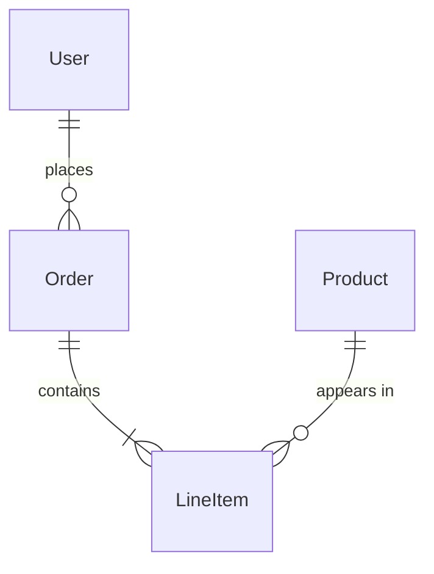

# README Template Reference

## Standard Template

```markdown
# <Module Name>

<One sentence: what this module does.>

## Public API

- `exportedFunction()` - brief description
- `AnotherExport` - brief description

## Use It Like This

<Single code snippet showing import + call, or a short narrative.>

## Responsibility Boundary

<What this module owns vs. what it delegates. 1-2 sentences.>

## Data Model

<Simplified Mermaid ER diagram — entities and relations only, no fields. Omit if the module has no meaningful data model.>



## Read Next

- [Child Module](./child/README.md)
- [Related Module](../related/README.md)
```

## Sizing by Level

### Root level (src/lib/, src/)
- Focus: Organization, layering rules
- Read Next: Yes, heavy
- Data Model: Yes, simplified across sub-modules
- Code example: No
- Length: ~20-35 lines

### Mid-tier (services/, tools/)
- Focus: Orchestration contracts
- Read Next: Yes, children + peers
- Data Model: If the module owns entities
- Code example: Brief
- Length: ~15-35 lines

### Leaf (auth/, openapi/, filesystem/)
- Focus: API surface only
- Read Next: Rarely
- Data Model: Only if it owns entities
- Code example: Sometimes
- Length: ~10-25 lines

## Rules

1. Under 30 lines when possible
2. Public API lists exports — what callers actually import, not internal helpers
3. Responsibility Boundary — the critical sentence that prevents scope creep
4. Read Next links are relative — they create the navigation graph
5. Never duplicate — don't explain a child module's internals, link to its README
6. No private functions, no tutorials, no caller descriptions
7. Data Model diagrams show entities and relations only — no fields. For root-level READMEs covering complex sub-modules, simplify by showing only top-level entities. Omit the section entirely if the module has no meaningful data model
