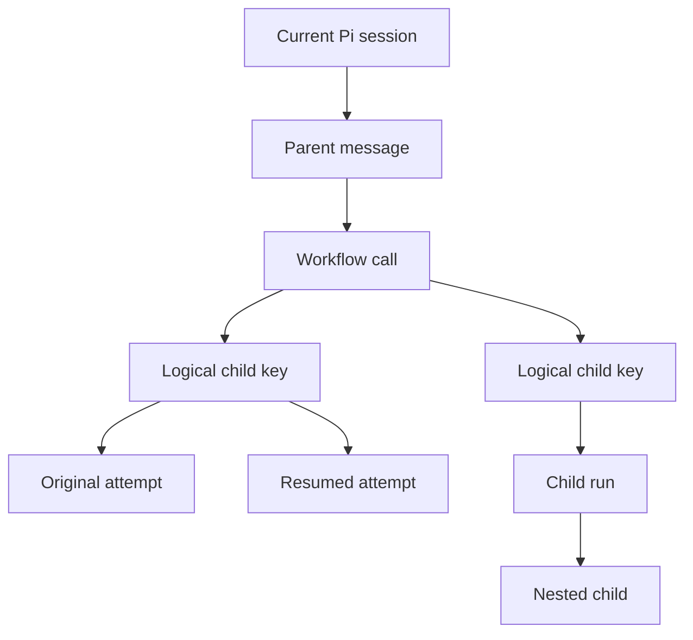

# Pi subagent session dashboard

Status: proposed

## Summary

Build a Pi companion extension that opens a session-specific subagent history dashboard inside Pi.

The user opens or resumes a Pi session, runs `/subagents-history`, and gets a tree of every subagent workflow associated with that session. The view shows active and historical runs, logical child lanes, resumed attempts, nested children, model details, prompt previews, timing, usage, output, and control actions.

The existing FleetView remains useful for compact active-run status. This dashboard is for understanding a session after it has launched several workflows.

## User goal

For the current Pi session, answer these questions quickly:

- How many subagent workflows ran?
- How many logical agents and process attempts did they create?
- Which agents are pending, queued, running, paused, complete, failed, or stopped?
- Which agent profile, model, thinking level, and context mode did each child use?
- What task did each child receive?
- When did each child start, how long did it run, and what was it doing?
- How many turns, tools, tokens, and dollars did each child use?
- Was a child resumed, and which attempts belong to the same logical lane?
- Did a child launch nested subagents?
- What output, transcript, artifacts, and session file belong to the child?
- Can a live child be steered or stopped from the same view?

## Entry point

```text
/resume
# Open or switch to a Pi session.

/subagents-history
# Open the dashboard for the current session.
```

Possible variants:

```text
/subagents-history current
/subagents-history pick
/subagents-history --active
/subagents-history --failed
```

The first version only needs `/subagents-history` for the current session. It opens as a centered modal overlay above the conversation instead of replacing the editor at the bottom.

## Main view

```text
╭─ Subagent history · Monitoring exploration · Active branch ─────────────╮
2 workflows · 4 attempts · ● 1 running · ✗ 0 failed
Chronological start order · oldest at top · --:--:-- means unknown
├──────────────────────────────────────────────────────────────────────────┤
19:44:30  ▾ W1  Explore monitoring                              ✓ 2m14s
19:44:40    │ W1 / workflow-map · #1 scout                      ✓ 1m56s
19:44:44    │ W1 / observability-map · #1 scout                 ✓ 2m07s
19:46:50  ▾ W2  Review dashboard                                ● 34s
19:46:50 >  │ W2 / review · #1 reviewer                         ● 34s
╰──────────────────────────────────────────────────────────────────────────╯
```

The timeline only encodes order: read observed start times from top to bottom. It does not turn concurrency into a chart. The header keeps only scan-level state. Full model, context, usage, tool, and prompt information stays in the bounded inline detail. A resumed child is one logical agent with `#1`, `#2`, and later attempts.

## Detail view

Workflow and attempt rows form one vertical chronological list based on observed start time. Unknown start times appear last with `--:--:--`. The view does not infer concurrency or reconstruct unavailable script intent.

Selecting a child expands a full-width detail block directly beneath that child in the tree. The dashboard uses one inline flow rather than a split pane:

```text
observability-map

State       completed
Agent       scout
Model       openai-codex/gpt-5.6-sol
Thinking    low
Context     fresh
Started     19:44:40
Duration    2m07s
Usage       79.2k tokens · $0.61
Turns       8
Tools       32
Run ID      83a06930...

Prompt preview
Read the installed pi-subagents package...
Inventory current observability and monitoring data...

[Summary] [Prompt] [Activity] [Output] [Artifacts] [Session]
```

Tabs:

- Summary shows identity, state, timing, model, context, and usage.
- Prompt shows the launch task with truncation and attribution warnings when needed.
- Activity shows lifecycle events, recent tools, attention events, steering, and retries.
- Output shows the final response or live output tail.
- Artifacts shows saved output, metadata, workflow receipt, status, and event records.
- Session shows the child session path and opens or previews its transcript.

## Tree model



The dashboard distinguishes four levels:

1. Workflow call: one top-level `subagent` invocation.
2. Logical child: one stable workflow key such as `workflow-map`.
3. Attempt: one actual child run ID. Resume creates a new attempt.
4. Nested child: a subagent launched by a child that was explicitly allowed to fan out.

Missions, schedules, external jobs, project panes, Herdr inspectors, and Orca views are linked records. They are not all native descendants in the execution tree.

## States

```text
○ pending
◌ queued
● running
⚠ needs attention
■ paused
✓ completed
✗ failed
■ stopped
⊘ rejected
```

State meanings must remain distinct:

- Pending means the workflow knows about a child but has not launched it.
- Queued means a launch exists but has not started execution.
- Running means execution is active.
- Needs attention is an activity signal, not a lifecycle state.
- Paused means execution was interrupted or is waiting for direction.
- Stopped means explicitly cancelled and not resumable.

## Session association

Each dashboard opens against the current `SessionManager` session.

Primary identity:

```text
session header ID
session file path
active branch leaf ID
```

For tool-launched workflows, `status.json` contains both `sessionId` and `toolCallId`. The parent session JSONL contains the matching tool call. This lets the dashboard attach a workflow to the exact parent conversation entry.

The view should offer two scopes:

- Active branch: show workflows attached to entries on the current branch.
- Whole session: include workflows attached to abandoned branches.

The first version may default to the active branch and expose a toggle for the whole session.

## Existing data sources

### Parent Pi session

`ctx.sessionManager` provides:

- Session ID and session file
- Session name and cwd
- Active branch and complete entry tree
- Parent messages and tool calls
- Tool result details
- Parent model usage

### Async lifecycle status

Each async root has a `status.json` containing fields such as:

- Root run ID and tool call ID
- Parent session ID
- Mode and lifecycle state
- Start, update, end, and duration timestamps
- Workflow steps and stable keys
- Child run IDs
- Agent, model, thinking, and context mode
- Current tool and recent tools
- Tool and turn counts
- Token and cost totals
- Child session and transcript paths
- Nested children
- Acceptance, budget, and process-terminal state

### Lifecycle events

`events.jsonl` contains lifecycle and control history, including:

- Workflow and run start
- Child start and completion
- Failure, pause, stop, and rejection
- Steering requests and delivery
- Attention events
- Recovery events
- Process-terminal evidence

### Workflow receipt

`workflow-receipt.json` provides:

- Stable workflow key to child run mapping
- Latest run ID
- Continuation run IDs
- Resume lineage
- Resumability state and reason
- Requested and resolved context
- Terminal outcome

### Child session files

Child session JSONL provides:

- Exact child conversation
- Model and thinking changes
- Assistant usage
- Tool calls and tool results
- Final output
- Prompt evidence

Prompt attribution is exact for fresh children whose first user task belongs to the launch. Forked sessions contain inherited history, so the collector must identify the launch delta or label the preview as best effort.

### Pi-subagents RPC and events

Use the process-local RPC for:

- Capability discovery
- Live status
- Steering
- Interrupt
- Stop
- Resume

Use process-local events as low-latency hints:

- `subagent:async-started`
- `subagent:async-complete`
- `subagent:child-status`
- `subagent:process-terminal`

Lifecycle files remain authoritative after reloads and missed events.

## Why a companion ledger is needed

Current records have different retention rules:

- Async run directories are retained for about 30 days.
- Debug artifacts default to 7 days.
- Temporary workflow artifacts may be cleaned after 24 hours.
- FleetView keeps a bounded recent window.
- Completion replay and archives expire.
- Nested projections are bounded and may remove older event inputs.
- Foreground history relies partly on process memory and session tool results.

The companion extension should ingest important milestones before those records disappear.

Suggested store:

```text
~/.pi/agent/subagent-history/<session-id>/
├── session.json
├── events.jsonl
└── snapshots/
    └── <workflow-run-id>.json
```

Do not write an update for every token or output chunk. Record milestones:

```text
workflow-started
child-discovered
child-started
child-state-changed
child-completed
child-resumed
child-steered
child-stopped
workflow-completed
```

The live view still reads current lifecycle files. The ledger preserves history and indexes it by session.

## Normalized records

### Workflow record

```typescript
interface SessionWorkflowRecord {
  sessionId: string;
  sessionFile?: string;
  parentEntryId?: string;
  parentToolCallId?: string;
  workflowRunId: string;
  missionId?: string;
  goal?: string;
  state: string;
  startedAt: number;
  endedAt?: number;
  durationMs?: number;
  logicalChildren: LogicalChildRecord[];
  totalTokens?: number;
  totalCostUsd?: number;
}
```

### Logical child record

```typescript
interface LogicalChildRecord {
  workflowKey: string;
  label?: string;
  phase?: string;
  agent?: string;
  requestedContext?: "fresh" | "fork";
  resolvedContext?: "fresh" | "fork" | "mixed";
  attempts: ChildAttemptRecord[];
}
```

### Attempt record

```typescript
interface ChildAttemptRecord {
  runId: string;
  state: string;
  model?: string;
  thinking?: string;
  promptPreview?: string;
  promptAttribution?: "exact" | "best-effort" | "unavailable";
  startedAt?: number;
  endedAt?: number;
  durationMs?: number;
  turnCount?: number;
  toolCount?: number;
  inputTokens?: number;
  outputTokens?: number;
  totalTokens?: number;
  costUsd?: number;
  sessionFile?: string;
  transcriptPath?: string;
  outputPath?: string;
  nestedChildren?: ChildAttemptRecord[];
}
```

Unknown usage must remain unknown. Do not display missing provider cost as `$0.00`.

## Aggregation rules

- Count logical agents by stable workflow key.
- Count attempts by child run ID.
- Count a resumed child as another attempt under the same logical child.
- Do not add nested usage twice when a parent total already includes it.
- Prefer provider-qualified model IDs from receipts or result metadata.
- Keep requested and resolved context separate.
- Derive elapsed time from `durationMs`, or from start and terminal timestamps.
- For an active child, derive elapsed time from `startedAt` and the current clock.
- Treat attention as an overlay on lifecycle state.
- Treat project panes and external jobs as linked peers with their own ownership labels.

## Pi user interface

Implement the dashboard as a full-screen `ctx.ui.custom()` component opened by a registered command.

Suggested controls:

```text
↑↓ / jk     select row
Enter       expand or inspect
Space       collapse or expand subtree
p           prompt preview
t           transcript
a           activity and tools
r           refresh
s           steer live child
R           resume eligible child
D           stop active workflow
f           filter by state
b           toggle active branch or whole session
Esc         close
```

The component should:

- Cache rendered lines by terminal width.
- Invalidate and request render after state changes.
- Use Pi theme colors.
- Keep every rendered line within the supplied width.
- Poll or watch only while the component is open.
- Re-read authoritative status after low-latency event hints.
- Clean up watchers and timers when the component closes or the session shuts down.

## First release

The first release should support:

- Current Pi session only
- Active branch and whole-session toggle
- Async workflow roots
- Workflow child tree
- Stable logical child keys
- Resumed attempt lineage
- Native nested children when projected
- State, agent, model, thinking, and context
- Prompt preview
- Start time and duration
- Tool, turn, token, and cost counts
- Output and transcript preview
- Manual refresh
- Live steer and stop through existing controls

## Later releases

Possible additions:

- Session picker inside the command
- Foreground workflow ingestion with full parity
- Mission grouping
- Schedule origin display
- Worktree and patch handoff links
- External CLI and external-job detail adapters
- Herdr inspector opening
- Search and filtering
- Timeline or Gantt view
- Export to Markdown or JSON
- Local web view backed by the same normalized ledger

## Risks and open questions

1. Prompt attribution for forked children needs a safe extraction rule.
2. Existing history may already be incomplete after artifact cleanup.
3. Nested projections are bounded, so deep historical trees can be lossy.
4. RPC Fleet DTOs omit some durable IDs. The collector must use lifecycle files or a new public observability API.
5. A host can dispose the originating session while detached work continues, which loses wake delivery but not the run.
6. External CLI runners expose less native detail than Pi children.
7. Project panes are peer Pi sessions. Their internal agents cannot be presented as controlled descendants of the original session.
8. Session records and child prompts may contain sensitive source code or credentials. The dashboard must remain local and avoid automatic export.

## Recommended implementation boundary

Do not import private FleetView internals into the companion extension.

Prefer:

1. Public Pi extension and TUI APIs.
2. Pi-subagents in-process RPC for status and controls.
3. Public lifecycle artifacts for recovery and detail.
4. A small companion-owned normalized ledger.
5. A future public pi-subagents observability API if filesystem coupling becomes fragile.

The same collector and normalized records should support both the Pi TUI and a later local web dashboard.

## Reference implementation inspected

This design is based on installed `pi-subagents` version `0.58.0` and these main files:

- `docs/observability.md`
- `docs/workflows.md`
- `docs/tool-reference.md`
- `docs/extension-api.md`
- `src/shared/types.ts`
- `src/tui/fleet.ts`
- `src/tui/fleet-status.ts`
- `src/workflows/workflow-receipt.ts`
- `src/runs/background/async-status.ts`
- `src/runs/shared/nested-events.ts`
