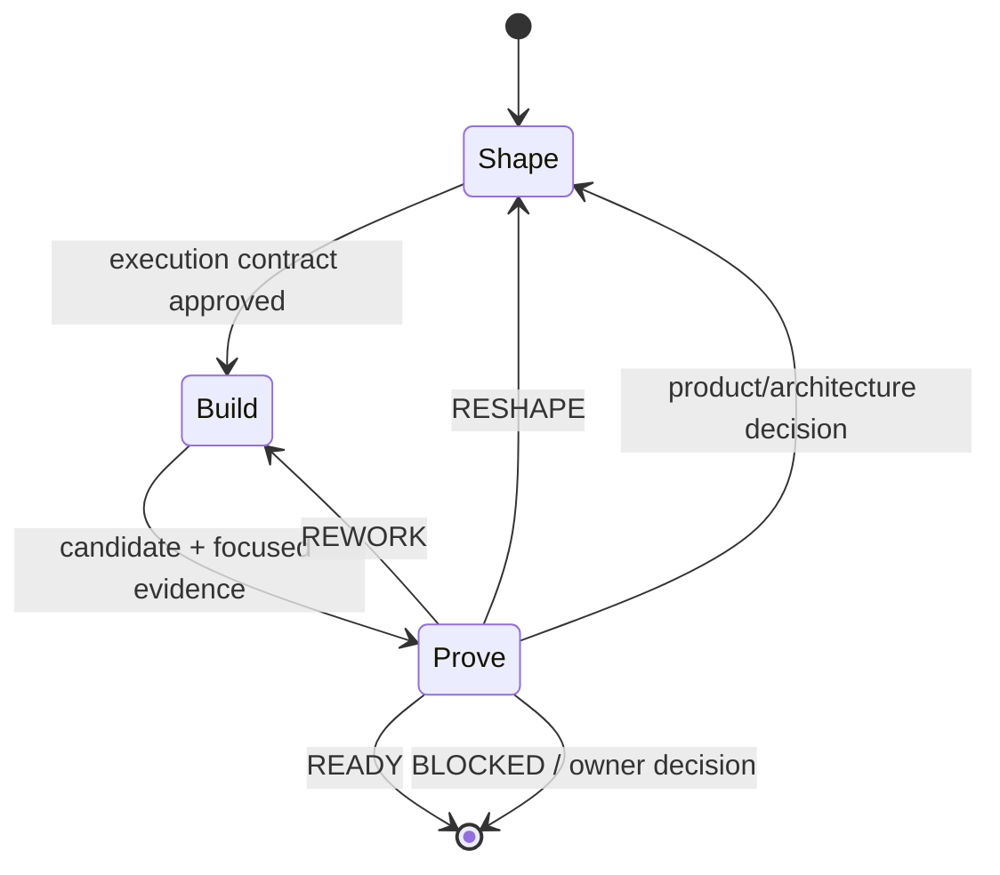

# Software Factory — Charter and Operating Model

> **Status: active pilot.** This directory is now the active shared skill
> system. Shape, Build, Prove, and Orchestrate are being calibrated through live
> tasks; treat observed runtime behavior as evidence and keep changes reviewable
> and easy to roll back.

## Why this directory exists

The previous skill collection contained useful capabilities, but many appeared
as unrelated top-level workflows. The result was noisy routing, duplicated
instructions, inconsistent handoffs, unnecessary agent turns, and expensive
models doing mechanical work.

The factory should turn those capabilities into a small, coherent software
production system. Its job is to move one bounded task from uncertainty to an
evidence-backed result while selecting the cheapest reliable execution path and
reserving the strongest models for decisions and assurance where they add the
most value.

The intended public process is:

```text
Shape → Build → Prove
          ▲       │
          └───────┘ bounded remediation
```

The process is a state machine, not a one-way checklist:



A task may enter at any stage. A staged PR can enter at **Prove**. A clear bug
with a reproduction can enter at **Build**. An ambiguous idea enters at
**Shape**.

## The three stages

### 1. Shape

Purpose: turn a request, issue, diff, or problem into an executable contract.
Research and planning live here; they are strategies, not separate delivery
systems.

Shape may use repository reconnaissance, external research, domain modeling,
interface design, prototyping, and plan stress-testing. It produces an
**Execution Contract** containing:

- observable outcome;
- authoritative source and fixed range of work;
- scope, non-goals, and protected state;
- required behavior and invariants;
- known dependencies and risks;
- material decisions and unresolved decision gates;
- acceptance evidence and authoritative verification commands;
- permissions and approval boundaries;
- definition of done.

Shape exits only when an implementer and an independent reviewer could both use
the contract without inventing product or architecture decisions.

### 2. Build

Purpose: produce the smallest candidate that satisfies the Execution Contract.

Rules:

- one writer owns a checkout at a time;
- use the cheapest model that can reliably execute the contract;
- use reproduction-first or TDD for behavioral fixes where practical;
- parallelize only isolated work or use separate worktrees;
- do not let successful mechanical commands consume model context;
- record deviations, changed files, focused evidence, and residual risks.

Build produces a **Candidate**:

- fixed base and candidate identity;
- implementation diff;
- focused tests or reproductions;
- decisions made during implementation;
- known limitations and residual risks.

### 3. Prove

Purpose: attempt to disprove that the Candidate satisfies the Execution
Contract.

Prove selects only the review profiles justified by the risk: spec,
standards/design, production boundaries, security/privacy, compatibility,
data/migration, UX/accessibility, or other domain-specific profiles. Reviewers
are read-only and independent of the implementation owner. For non-trivial
iterative review, Prove compiles a Candidate-bound Review Manifest, dispatches
focused checks that return untrusted Claims, applies deterministic admission,
and adversarially falsifies admitted consequential Claims before validating a
Finding.

Prove produces one of four typed verdicts:

| Verdict | Meaning | Next state |
|---|---|---|
| `READY` | Contract and required gates are satisfied | Done |
| `REWORK` | Contract is sound; candidate has bounded defects | Build |
| `RESHAPE` | Finding invalidates or expands the contract/design | Shape |
| `BLOCKED` | An owner decision or unavailable dependency is required | Stop and ask |

A finding is not accepted merely because a reviewer emitted it. It must identify
an invariant or contract violation, concrete evidence or reproduction, impact,
confidence, and the smallest safe correction. The coordinator validates and
deduplicates findings before rework.

## Public skill interface

The factory should become a deep module: a small public interface hiding a
large amount of routing and execution behavior.

Target public entry points:

```text
/orchestrate <task source> [from: auto | shape | build | prove]
/shape <task source>
/build <execution contract>
/prove <candidate>
```

`orchestrate` owns state transitions, model selection, fan-out, command
supervision, synthesis, evidence, and final handoff. `shape`, `build`, and
`prove` are explicit stage entry points, not non-orchestrated shortcuts. When a
stage needs fan-out, long commands, model routing, or lifecycle management, it
uses the same Orca runtime as `/orchestrate ... from:<stage>`.

Do not expose every technique as a peer workflow. Existing capabilities should
be inventoried and moved behind the appropriate stage:

| Existing capability | Intended home |
|---|---|
| research, domain modeling, grilling, interface design, prototyping | Shape strategies |
| TDD, bug diagnosis, refactoring/migration helpers | Build strategies |
| code review, Ryan review, QA, security and standards checks | Prove profiles |
| Orca orchestration | Internal execution runtime |

Keep genuinely narrow operator-invoked utilities separate when merging them
would not reduce routing complexity.

## Orca is the execution core

Assume Orca is available and is the factory's process runtime. Use it for task
state, supervised fan-out, worker lifecycle, terminal management, worktree
isolation, decision gates, and completion evidence.

Orca orchestration tasks are for work requiring an agent. A command does not
need an agent merely because it takes time.

### Direct command execution

Tests, builds, linting, formatting, type checks, and migration checks normally
run through the coordinator's Bash tool. Orca coordinates agents; do not create
raw command panes, process-supervisor scripts, or command-monitoring agents for
ordinary deterministic gates.

For useful concurrency:

1. dispatch independent Orca agents first;
2. run required Bash commands, in parallel tool calls when shared state permits;
3. collect agent lifecycle results after commands return.

The coordinator blocks during its Bash call, but already-dispatched Orca agents
continue working. A Bash timeout is a maximum and returns early when the command
exits. Successful output stays compact; failures retain bounded actionable
output. Agent workers may run focused Bash commands in their own terminals and
report exact exits, while the coordinator owns final authoritative gates.

If a command requires interaction, open a decision gate or explicitly assign it
to an Orca agent whose interaction authority is bounded. If failure requires
semantic code investigation, use a Build/diagnosis agent. See
`orchestrate/references/command-runner.md`.

## Model routing

Responsibilities are stable; model assignments are configuration and will
change as models improve. Never bake a model name into a stage's behavioral
contract.

### Stable routing policy

| Role | Responsibility | Required properties | Default cost tier |
|---|---|---|---|
| Command execution | Run deterministic gates through Bash and capture exits | Coordinator tool, no delegated model | T0 |
| Scout | Map code, docs, dependencies, and risks | Fast, large-context, tool-capable | T1 economy |
| Review planner | Compile the iterative Review Manifest, select checks, and deduplicate command/context needs | Reliable synthesis over compact scout evidence | T2 |
| Focused Claim finder | Evaluate one bounded check and propose falsifiable consequential Claims | Precise, skeptical, read-only, budget-bounded | T1–T2 |
| Adversarial Claim verifier | Try to kill one admitted Claim, preferring execution when cheap | Independent, execution-capable, consequence-calibrated | T2 |
| Builder | Implement a well-shaped bounded change | Cheapest model reliable for the contract | T1–T2 |
| Designer | Resolve material interface or architecture choices | Strong reasoning and synthesis | T2–T3 |
| Spec reviewer | Compare candidate with intent and invariants | Independent, precise, skeptical | T2–T3 |
| Production/security reviewer | Find boundary, abuse, data, and operational failures | Independent, boundary-capable, execution-aware; different family when assurance benefits | T2–T3 |
| Blind final-gate reviewer | Review the whole frozen Candidate from its base in a fresh loop-blind context | Independent, broad, skeptical; highest capability for high-risk delivery | T2–T4 |
| Assurance adjudicator | Resolve contradictory evidence or material residual-risk disputes after the blind gate | Highest-capability model with precise evidence synthesis | T3–T4 |
| Coordinator | Route stages, validate findings, control state, synthesize | Reliable planning and tool use; need not always be the most expensive | T2 |

### Initial editable model calibration

This is a starting configuration, not a permanent assignment. Responsibilities
should remain stable while model assignments evolve from measured evidence.

| Role | Initial runtime/model | Intended use |
|---|---|---|
| Coordinator | Pi / `gpt-5.6-sol`, xhigh | State control, routing, finding validation, synthesis |
| Review Manifest scouts/finders | Economy tool-capable workers, initially unpinned | Repository mapping and focused Claim generation |
| Claim verifier | Independent execution-capable worker, initially T2 | Adversarial falsification before premium escalation |
| Builder | Cheapest contract-capable model; initially unpinned | Bounded implementation with focused evidence |
| Production reviewer | Codex CLI / configured `gpt-5.6-sol` | Production-boundary and operational-risk review |
| Spec/security reviewer | Risk-calibrated independent T2–T3 model; Opus 5.0 only for high-risk escalation | Spec, security, privacy, and high-risk assurance |
| Standards reviewer | Pi worker / `gpt-5.6-sol`, medium/high by complexity | Interface, tests, and repository standards |
| Blind final-gate reviewer | Fresh Claude Code / Opus 5.0 session for high-risk work; risk-calibrated independent model otherwise | Whole-Candidate review with no remediation-loop context; prefer a family that has not already reviewed the Candidate |
| Assurance adjudicator | Claude Code / Opus 5.0 | Optional evidence adjudication after the blind gate when risk or disagreement warrants it |
| Mechanical verification | Shell commands | Tests, lint, formatting, build, and diff checks |

Routing rules:

1. Risk and ambiguity determine model strength, not stage name alone.
2. Use the cheapest model that can reliably satisfy the contract.
3. Prefer a stronger and, when possible, different model family for assurance.
4. Do not let an implementation model be the sole judge of its own work.
5. Use the top model for material decisions, a high-risk blind final gate, or
   consequential assurance adjudication—not for waiting on tests or summarizing
   green output.
6. Escalate a builder when repeated rework shows the contract exceeds its
   capability; do not compensate with endless reviewer loops.

## Context and evidence discipline

Model context is a scarce production resource.

- Successful commands contribute a one-line result, not their complete logs.
- Failed commands contribute bounded relevant output plus a reference to the
  full evidence.
- Reviewers receive the Execution Contract, fixed diff, relevant repository
  instructions, and required evidence—not the coordinator's entire transcript.
- Iterative Prove workers receive only their selected check, relevant
  requirements/proof obligations, Candidate identity, applicable
  observed/owner-asserted Review Manifest facts, and needed shared command
  evidence. Review Manifest inferences remain labeled hypotheses.
- Focused finders return Claims rather than accepted Findings. The coordinator
  applies deterministic admission and an independent execution-first verifier
  before premium adjudication or Finding validation.
- Broad/shared commands run once under coordinator ownership; finder workers
  remain read-only and verifier probes must be isolated from the Candidate and
  shared evidence.
- A **blind final-gate reviewer** receives only a requirements-only brief derived
  from authoritative PR/product intent and acceptance criteria (with review-loop
  narrative removed),
  repository instructions, fixed base and Candidate identity, the exact
  whole-diff command, the neutral reviewer-facing whole-Candidate protocol/output
  schema inlined into the prompt or copied to a neutral path outside the factory
  tree, the fixed absolute dispatch deadline with a `blocked`-before-expiry
  instruction, and read-only boundaries.
  It must not receive the run journal, iterative Review Manifest,
  selected-check list, Claims/verifier dispositions, Assurance Packet, prior
  reports or comments, findings, resolutions, remediation summary, targeted
  patch, intermediate commit history, mechanical-gate results, coordinator
  recommendation, or a checklist of what to confirm. Task, terminal, brief,
  protocol, and report names/paths exposed to the reviewer must be neutral;
  never expose a protocol path inside the factory skills tree.
- Accept a blind final-gate report only when it matches the frozen identities,
  attests that only supplied inputs were used, attests complete changed-artifact/
  hunk coverage, and does not disclose use of excluded context. Reject partial,
  identity-mismatched, contaminated, or `blocked` reports. For a `blocked`
  report, resolve the obstacle it names before the next dispatch. A final-gate attempt begins at worker dispatch. Set a fixed
  wall-clock deadline before dispatch (default 30 minutes); heartbeats do not
  extend it, and expiry is `no report`. The reviewer cannot use
  `ask`/`decision_gate`. Allow at most two attempts in total for one unchanged
  Candidate identity. Any dispatch that does not yield an accepted report—
  including worker failure, escalation, unanswered/withdrawn `decision_gate`, no
  report, rejection, contamination, or `blocked`—counts; after the second,
  return `BLOCKED` with both attempts preserved.
- Compile an **Assurance Packet** only after the blind final-gate report. It is a
  coordinator/human handoff artifact and may be used by a separate assurance
  adjudicator when evidence conflicts; it never substitutes for or becomes
  input to the blind final gate, and the adjudicator cannot unilaterally overturn
  a blind-gate finding already validated as blocking.
- Agents should report structured results rather than prose diaries.
- Preserve full logs outside model context only when they are useful for
  diagnosis or audit.

## Append-only run journal

Every supervised orchestration run keeps an ephemeral append-only JSONL journal
under `$TMPDIR/software-factory/runs/<run-id>/`. The coordinator is its sole
logical writer. Workers report artifacts/results; the coordinator appends
significant state, evidence, decision, attempt, finding, Candidate, command, and
transition events.

The journal supplies continuity across turns, compaction, model changes, and
review waves without copying the whole transcript. Use stable semantic subjects
so a new recommendation can be checked against previous attempts. If a reviewer
recommends reversing an earlier accepted/rejected decision, record a conflict
and reconcile both evidence sets before implementing either side; repeated A ↔
B movement usually means the contract or interface needs a third option.

Fresh reviewers normally remain blind to prior reviewer conclusions. The
coordinator checks history after receiving an independent report, then supplies
targeted history only for conflict adjudication. This preserves both reviewer
independence and pipeline memory.

The journal is not durable project knowledge. Keep secrets, customer data, full
logs, and raw transcripts out. Promote only load-bearing decisions/learnings to
the repository's normal docs, ADR, issue, or PR surfaces. See
`orchestrate/references/run-journal.md`.

## Review/remediation convergence

The default is not an unlimited swarm of reviewers.

A **reviewable Candidate** is any frozen, non-empty base-to-Candidate diff
proposed for merge, delivery, or owner acceptance, including trivial and
docs-only changes. Every reviewable Candidate requires the blind whole-Candidate
final gate before it is presented for merge, delivery, or owner acceptance under
any outcome—or marked `READY`—regardless of task size or risk.

For a normal non-trivial task:

1. Shape with direct work or a small read-only scout wave.
2. Build with one owner.
3. Freeze the Candidate and compile the iterative Review Manifest from contract,
   diff, applicable project knowledge, operating modes, and boundary facts.
4. Select the smallest distinct generic/project-local checks justified by risk.
5. Dispatch focused Claim finders, then run deduplicated mechanical gates
   through coordinator Bash while those agents continue working.
6. As checks complete, deterministically admit/reject Claims and stream admitted
   consequential Claims to independent execution-first verifiers.
7. Validate/deduplicate verifier-supported findings and resolve consequential
   gaps; use premium adjudication only for risk/evidence-triggered conflict.
8. Rework only validated findings.
9. During iteration, re-run affected mechanical gates and targeted review of
   changed seams.
10. Once the Candidate is stable, run a fresh, loop-blind final-gate reviewer
   over the complete cumulative base-to-Candidate diff. Each stabilized
   Candidate identity needs its own accepted final-gate report. At most three
   distinct Candidate identities may enter the blind gate in one run without
   owner authorization, regardless of what caused each mutation. If the third
   identity's report requires another mutation, stop before creating the fourth
   identity and ask the owner to `RESHAPE`, accept explicit risk on the currently
   gated identity, or authorize one additional remediation-and-gate cycle; never
   present an un-gated identity for acceptance.
11. Use a separate premium Assurance Packet adjudicator only when risk,
   disagreement, or consequential residual uncertainty warrants it.

Use additional reviewers only when their lens is independent and likely to
change the verdict. Avoid repeated full reviews during remediation, but never
replace the whole-Candidate blind final gate for each stabilized identity with
targeted re-reviews.

### Class-over-instance rule

If a second analogous defect appears, stop patching examples and inspect the
underlying seam. Prefer a shared invariant, interface, allocator, parser, or
policy plus a property/invariant test. Repeated findings in the same class
usually mean `RESHAPE`, not another local `REWORK`.

### Stop rule

A run is complete when:

- the observable done condition is met;
- all selected iterative checks completed or have an evidence-backed blocking
  disposition;
- every Claim is rejected at admission, independently verified, or retained as
  a consequential gap with an explicit disposition;
- all validated blocking findings are resolved;
- authoritative mechanical gates pass;
- required independent profiles are clean;
- an accepted fresh loop-blind final-gate report covers the complete cumulative
  diff for the current Candidate, every final-gate proposal is dispositioned
  with evidence, no validated blocking finding or unresolved consequential gap
  remains, and each validated non-blocking finding is recorded as accepted
  residual risk with a named owner;
- the reviewed Candidate has not changed since the final evidence;
- residual risks and next owner are explicit;
- all supervised agent terminals created by the run are cleaned up after their
  lifecycle evidence is captured.

## Learning loop

The factory should improve from delivery evidence without turning every run
into permanent prompt growth.

Track enough structured metadata to compare routes:

- task risk and stage entered;
- models and roles used;
- elapsed time and estimated cost by stage;
- agent turns versus direct command time;
- Review Manifest scout/check selection cost;
- Claims proposed, rejected at admission, rejected by verification, validated,
  or retained as consequential gaps;
- executed-probe yield and duplicated shared commands avoided;
- premium escalation count and reason;
- findings emitted, validated, duplicated, and rejected;
- remediation rounds;
- escaped defects or later review findings;
- context consumed by successful and failed command output.

Promote a lesson into a shared profile when it is high severity, recurs, or
expresses a general invariant. Keep one-off project facts in the project, not in
the global factory.

## Safety invariants

- Preserve repository-local instructions and protected user changes.
- Never commit, push, publish, switch branches, create worktrees, or perform
  destructive actions without the required approval.
- Never run parallel writers in one checkout.
- Never review an unspecified or moving comparison target.
- Never treat a targeted remediation review, prior-context adjudication, or
  Assurance Packet review as the blind whole-Candidate final gate.
- Never treat agent activity as evidence of completion.
- Never treat a finder Claim or reviewer agreement as a validated Finding.
- Never let iterative finders edit the Candidate or allow verifier probes to
  contaminate shared review evidence.
- Never treat a review finding as true without validation.
- Never expose secrets or send sensitive logs broadly to reviewers or journals.
- Never rewrite/truncate an active run journal or treat it as project authority.
- Never hide a material decision inside an implementation delegation.

## Current active layout

```text
skills/
├── AGENTS.md
├── shape/
│   ├── SKILL.md
│   └── references/       # execution contract, strategies, designs, provenance
├── build/
│   ├── SKILL.md
│   └── references/       # candidate, strategies, designs, provenance
├── prove/
│   ├── SKILL.md
│   └── references/       # protocol, profiles, assurance packet, designs
└── orchestrate/
    ├── SKILL.md
    ├── references/       # state, journal, Orca, models, workers, commands
    └── scripts/          # append/query journal helper
```

The interfaces were designed before the drafts were written; each skill keeps
its alternatives and migration provenance in references. The deletion test
continues to apply: if removing a proposed skill merely moves the same
complexity into every caller, it deserves to exist; if nothing becomes harder,
it is ceremony.

## Migration backlog

During the active pilot:

1. **In progress:** inventory previous skills by Shape, Build, Prove, utility,
   and unrelated specialist domains. Relevant source skills are recorded in each
   stage's `source-learnings.md`; a full disposition inventory still remains.
2. **In progress:** identify duplicated routing and contradictory instructions.
3. **Drafted:** Execution Contract, Candidate, Finding/Verdict protocol, and
   Assurance Packet schemas.
4. **Simplified from live pilot feedback:** deterministic gates use direct Bash
after independent Orca agents are dispatched. Raw command panes, the process
supervisor, and command observers were removed; semantic failures route to
bounded Build/diagnosis agents.
5. **Drafted:** one editable model calibration in this charter with operational
   routing in `orchestrate/references/model-routing.md`.
6. **Drafted:** multiple interface designs and selected rationale for Shape,
   Build, Prove, and Orchestrate.
7. **Drafted, helper smoke-tested:** append-only run journal, event vocabulary,
   anti-oscillation/resume protocol, and local append/query helper.
8. **In progress:** pilot the factory on tasks of different risk and entry
   stage, including direct stage invocation and `/orchestrate from:<stage>`.
9. Compare time, cost, finding yield, rework, context use, journal usefulness,
   lifecycle-wait behavior, and escaped defects against the previous system.
10. Prune after pilots; remove no-ops, duplication, and unused branches.
11. Keep the active wiring easy to roll back while contracts stabilize.

## How to evolve this directory

- Treat this file as the charter; each stage skill owns its execution behavior.
- Keep the public interface small and put detail in references.
- Change responsibilities cautiously; update model assignments freely as
  evidence changes.
- Prefer measured improvements over adding another top-level skill.
- Record unresolved design questions explicitly instead of silently choosing.
- Because this directory is active, validate links/scripts and preserve a clear
  rollback path for behavior-changing edits.
